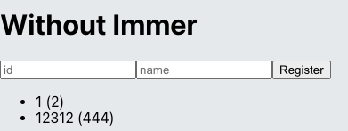
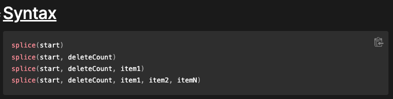
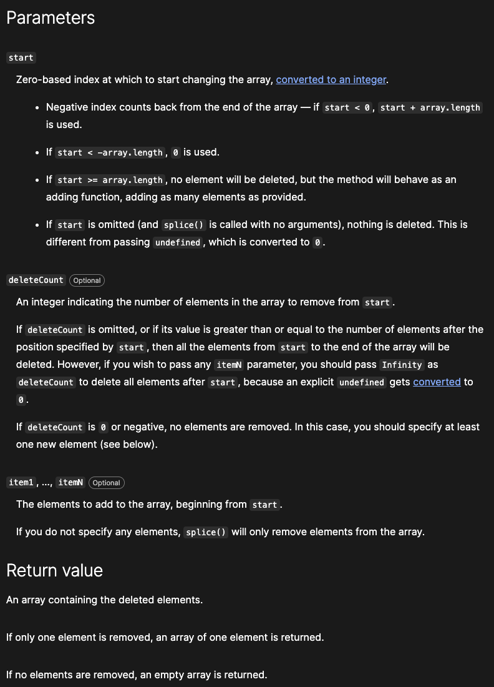
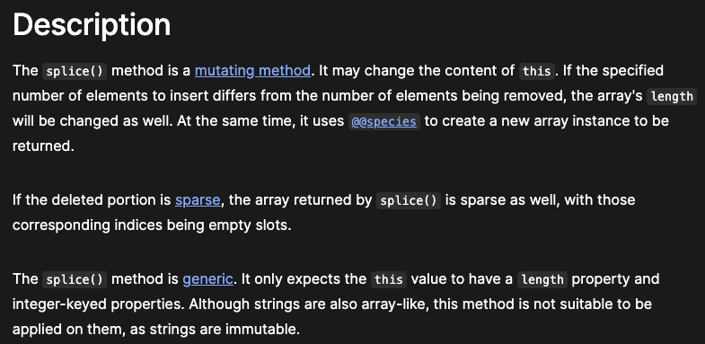

>**💡 info** 


```jsx
const object = {
  somewhere: {
    deep: {
      inside: 3,
      array: [1,2,3,4]
    },
    bar: 2
  },
  foo: 1
};

//somewhere.deep.inside value set to 4
let nextObject = {
  ...object,
  somewhere: {
    ...object.somewhere,
    deep: {
      ...object.somewhere.deep,
      inside: 4
    }
  }
};

//somewhere.deep.array set to 5
let nextObject = {
  ...object,
  somewhere: {
    ...object.somewhere,
    deep: {
      ...object.somewhere.deep,
      array: object.somewhere.deep.array.concat(5)
    }
  }
};

```

> without immer, about 10 code line needed to modify one value.
> 1. install `immer`, study usage
> 2. make simple project using `immer`

<br />

## 12.1 install `immer` and learn usage
---

[immer official homepage](https://immerjs.github.io/immer/)

<br />

### 12.1.1 prerequisite
---
```bash
yarn create react-app immer-tutorial
cd immer-tutorial
yarn add immer
```

<br />

### 12.1.2 without `immer`, work with immutability
---
Write `ImmerApp.jsx` like this.
```jsx
import { useRef, useCallback, useState } from 'react';

const WithoutImmer = () => {
  const nextId = useRef(1);
  const [form, setForm] = useState({ name: '', username: ''});
  const [data, setData] = useState({
    array: [],
    uselessValue: null
  });

  // function that for modify input
  const onChange = useCallback(
    e => {
      const {name, value} = e.target;
      setForm({
        ...form,
        [name]: [value]
      });
    },
    [form]
  );

  // function for register form
  const onSubmit = useCallback(
    e => {
     e.preventDefault();
     const info = {
       id: nextId.current,
       name: form.name,
       username: form.username
     };

     //register new item to array
     setData({
       ...data,
       array: data.array.concat(info)
     });

     // initialize form
      setForm({
        name: '',
        username: ''
      });
      nextId.current += 1;
    },
    [data, form.name, form.username]
  );

  // function that delete item
  const onRemove = useCallback(
    id => {
      setData({
        ...data,
        array: data.array.filter(info => info.id !== id)
      });
    },
    [data]
    );

  return (
    <div>
      <form onSubmit={onSubmit}>
        <input
          name='username'
          placeholder="id"
          value={form.username}
          onChange={onChange}
        />
        <input
          name='name'
          placeholder="name"
          value={form.name}
          onChange={onChange}
        />
        <button type='submit'>Register</button>
      </form>
      <div>
        <ul>
          {data.array.map(info => (
            <li key={info.id} onClick={()=> onRemove(info.id)}>
              {info.username} ({info.name})
            </li>
          ))}
        </ul>
      </div>
    </div>
  );
};

export default WithoutImmer;
```
When insert id/name list you can see that value in below list, when click list item that item will delete component.



<br />

### 12.1.3 `immer` usage
---
>**💡 info** 
>Using `immer` to work with immutability, you can do works very simply.

```jsx
import produce from 'immer';  
  
const nextStag = produce(originalState, draft => {  
  // value that you want to change  
  draft.somewhere.deep.inside = 5;  
})
```

<br />

>- first parameter: state that to modify
>- second parameter: function that implements how to update 

<br />

>ImmerExample.jsx
```jsx
import produce from 'immer';

const originalState = [
  {
    id: 1,
    todo: 'destructuring assignment operator and built-in array function work with immutability',
    checked: true,
  },
  {
    id: 2,
    todo: 'work with immutability using immer',
    checked: false,
  }
];

const nextStag = produce(originalState, draft => {
  // value that you want to change
  const todo = draft.find(t => t.id === 2); // find item with 'id'
  todo.checked = true; // or draft[1].checked = true;

  // add data to array
  draft.push({
    id: 3,
    todo: 'Aply immer in TodoList App',
    checked: false,
  });

  // delete item with id=1
  draft.splice(draft.findIndex(t => t.id === 1), 1);
});
```

[* find function in javascript array](https://developer.mozilla.org/en-US/docs/Web/JavaScript/Reference/Global_Objects/Array/find)

<br />








> SpliceExample
```jsx
const months = ['Jan', 'March', 'April', 'June'];
months.splice(1, 0, 'Feb');
// Inserts at index 1
console.log(months);
// Expected output: Array ["Jan", "Feb", "March", "April", "June"]

months.splice(4, 1, 'May');
// Replaces 1 element at index 4
console.log(months);
// Expected output: Array ["Jan", "Feb", "March", "April", "May"]
```

<br />

### 12.1.4 Apply `immer` in App component
---

```jsx
import {useRef, useCallback, useState} from 'react';
import produce from 'immer';

const WithImmer = () => {
  const nextId = useRef(1);
  const [form, setForm] = useState({ name: '', username: ''});
  const [data, setData] = useState({
    array: [],
    uselessValue: null
  });

  //function for modify input
  const onChange = useCallback(
    e => {
      const {name, value} = e.target;
      setForm(
        produce(form, draft => {
          draft[name] = value;
        })
      );
    },
    [form]
  );

  // function for form register
  const onSubmit = useCallback(
    e => {
      e.preventDefault();
      const info = {
        id: nextId.current,
        name: form.name,
        username: form.username
      };

      // new item register to array variable
      setData(
        produce(data, draft => {
          draft.array.push(info);
        })
      );

      // form initialize
      setForm({
        name: '',
        username: ''
      });
      nextId.current += 1;
    },
    [data, form.name, form.username]
  );

  //function that delete item
  const onRemove = useCallback(
    id => {
      setData(
        produce(data, draft => {
          draft.array.splice(draft.array.findIndex(info => info.id === id), 1);
        })
      )
    },
    [data],
  );

  return (
    <div>
      <h1>With Immer</h1>
      <form onSubmit={onSubmit}>
        <input
          name='username'
          placeholder="id"
          value={form.username}
          onChange={onChange}
        />
        <input
          name='name'
          placeholder="name"
          value={form.name}
          onChange={onChange}
        />
        <button type='submit'>Register</button>
      </form>
      <div>
        <ul>
          {data.array.map(info => (
            <li key={info.id} onClick={()=> onRemove(info.id)}>
              {info.username} ({info.name})
            </li>
          ))}
        </ul>
      </div>
    </div>
  );
};

export default WithImmer;
```

<br />

### 12.1.5 Apply `immer` in `useState`'s functional update
---
```jsx
import {useRef, useCallback, useState} from 'react';
import produce from 'immer';

const FunctionalUpdateWithImmer = () => {
  const nextId = useRef(1);
  const [form, setForm] = useState({ name: '', username: ''});
  const [data, setData] = useState({
    array: [],
    uselessValue: null
  });

  //function for modify input
  const onChange = useCallback(
    e => {
      const {name, value} = e.target;
      setForm(
        produce(draft => {
          draft[name] = value;
        })
      );
    },
    []
  );

  // function for form register
  const onSubmit = useCallback(
    e => {
      e.preventDefault();
      const info = {
        id: nextId.current,
        name: form.name,
        username: form.username
      };

      // new item register to array variable
      setData(
        produce(draft => {
          draft.array.push(info);
        })
      );

      // form initialize
      setForm({
        name: '',
        username: ''
      });
      nextId.current += 1;
    },
    [form.name, form.username]
  );

  //function that delete item
  const onRemove = useCallback(
    id => {
      setData(
        produce(draft => {
          draft.array.splice(draft.array.findIndex(info => info.id === id), 1);
        })
      )
    },
    [],
  );

  return (
    <div>
      <h1>Functional update With Immer</h1>
      <form onSubmit={onSubmit}>
        <input
          name='username'
          placeholder="id"
          value={form.username}
          onChange={onChange}
        />
        <input
          name='name'
          placeholder="name"
          value={form.name}
          onChange={onChange}
        />
        <button type='submit'>Register</button>
      </form>
      <div>
        <ul>
          {data.array.map(info => (
            <li key={info.id} onClick={()=> onRemove(info.id)}>
              {info.username} ({info.name})
            </li>
          ))}
        </ul>
      </div>
    </div>
  );
};

export default FunctionalUpdateWithImmer;
```

> functional update with immer make two differences
> 1. produce functnion's first parameter is not needed
> 2. delete item in deps parameter 

<br />

## 12.2 Summary
---
> **💡 info** 
> 1. using immer is optioanal not all project code should use immer, but it can increase productivity. 