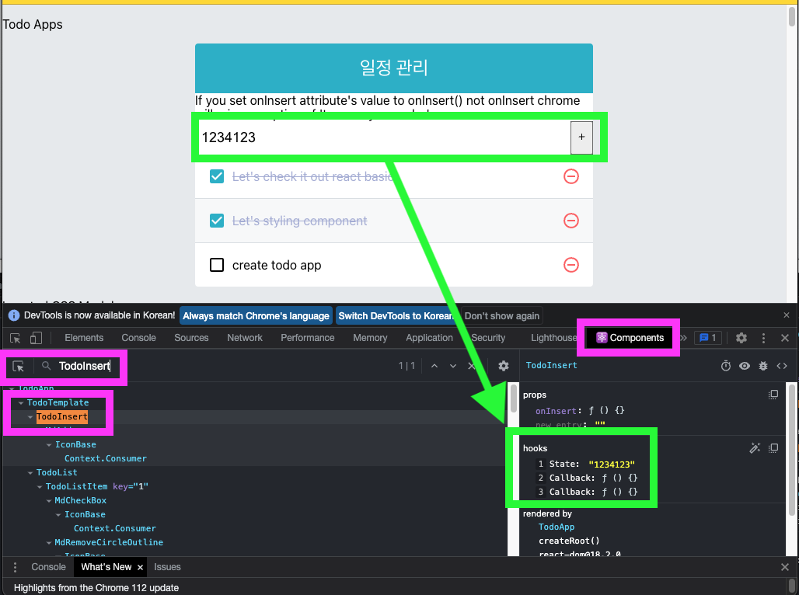

``  
> **💡 objective of this chapter**  
> 1. prepare project
> 2. UI structuring
> 3. Implement feature

<br />

### 10.1 prepare project 
---
#### 10.1.1 create project and library install
---
```bash
yarn create react-app todo-app
cd todo-app
yarn add sass classnames react-icons
```

<br />

#### 10.1.2 setting prettier
---
```json
{  
  "singleQuote": true,  
  "semi": true,  
  "useTabs": false,  
  "tabWidth": 2,  
  "trailingComma": "all",  
  "printWidth": 80  
}
```
<br />

#### 10.1.3 modify index.css
---
```css
body {  
  margin: 0;  
  padding: 0;  
  background: #e9ecef;   
}  
```

<br />

#### 10.1.4 Initialize App component
---

> TodoApp.js

```jsx
import React from 'react';  
import * as PropTypes from 'prop-types';  
  
function TodoTemplate(props) {  
  return null;  
}  
  
TodoTemplate.propTypes = {children: PropTypes.node};  
const TodoApp = () => {  
  return (  
      <div>Todo App</div>  
  );  
};  
  
export default TodoApp;
```

<br />

### 10.2 make up UI
---
todo list app composed of 4 components.

> 1. TodoTemplate
> 	1. align display to center and show app's title
> 2. TodoInsert
> 	1. new item add
> 	2. maange input\`s state through use state
> 3. TodoListItem
> 	1. show indivisual item information
> 	2. get todo object as a props, and show styles that depends state.
> 4. TodoList
> 	1. get todos array and convert multiple TodoListItem via built-in array function map.

```🔑info
src/components directory is traditional customary way store components.
```
this stage we concentrate build a architecture not implements feature.

<br />

#### 10.2.1 Implement TodoTemplate
---
`jsconfig.json`  file is VS Code\`s configuration file that in root directory of project.

1. make component
2. make parent component
3. assign style sheet file
4. add insert feature
5. use icon component

```jsx
import React from 'react';  
import './TodoTemplate.scss';  
  
const TodoTemplate = ({children}) => {  
  return (  
      <div>  
        <div className="TodoTemplate">  
          <div className="app-title">일정 관리</div>  
          <div className="content">{children}</div>  
        </div>  
      </div>  );  
};  
  
export default TodoTemplate;
```

<br />

#### 10.2.2 TodoInsert
---
> create TodoInsert.js
> create TodoInsert.scss


>TodoInsert.js

```jsx
import {MdAdd} from 'react-icons/md' // md: material design  
import React from 'react';  
import './TodoInsert.scss'  
  
const MyComponent = () => {  
  return (  
      <form className={"TodoInsert"}>  
        <input placeholder={'Insert todo job'} />  
        <button type={"submit"}>  
          <MdAdd />      
        </button>     
     </form>  );  
};  
  
export default MyComponent;
```

>TodoInsert.scss
```scss
.TodoInsert {  
  display: flex;  
  background: #495057;  
  
  input {  
    outline: none;  
    border: none;  
    padding: 0.5rem;  
    font-size: 1.125rem;  
    line-height: 1.5;  
    color: white;  
  
    &::placeholder {  
      color: #dee2e6;  
    }  
    flex: 1;  
  }  
  
  botton {  
    background: none;  
    outline: none;  
    border: none;  
    background: #868e96;  
    color: white;  
    padding-left: 1rem;  
    padding-right: 1rem;  
    font-size: 1.5rem;  
    display: flex;  
    align-items: center;  
    cursor: pointer;  
    transition: 0.1s background ease-in;  
  
    &:hover {  
      background: #adb5db;  
    }  
  }}
```


> TodoListItem.js
```jsx

import React from 'react';
import {MdCheckBoxOutlineBlank, MdRemoveCircleOutline} from 'react-icons/md';
import './TodoListItem.scss';

const TodoListItem = () => {
  return (
      <div className={"TodoListItem"}>
        <div className="checkbox">
          <MdCheckBoxOutlineBlank />
          <div className="text">To do</div>
        </div>
        <div className="remove">
          <MdRemoveCircleOutline />
        </div>

      </div>
  );
};

export default TodoListItem;


```

> TodoListItem.scss
```scss
.TodoListItem {  
  padding: 1rem;  
  display: flex;  
  align-items: center;  
  &:nth-child(even) {  
    background: #f8f9fa;  
  }  
  .checkbox {  
    cursor: pointer;  
    flex: 1;  
    display: flex;  
    align-items: center; //vertically center align  
    svg {  
      // icon  
      font-size: 1.5rem;  
    }    .text {  
      margin-left: 0.5rem;  
      flex: 1; // all range  
    }  
  
    // style when check  
    &.checked {  
      svg {  
        color: #22b8cf;  
      }      .text {  
        color: #adb5db;  
        text-decoration: line-through;  
      }    }  }  .remove {  
    display: flex;  
    align-items: center;  
    font-size: 1.5rem;  
    color: #ff6b6b;  
    cursor: pointer;  
    &:hover {  
      color: #ff8787;  
    }  }  
  // draw line between elements  
  & + & {  
    border-top: 1px solid #dee2e6;  
  }}
```


> TodoList.js
```jsx
import React from 'react';
import TodoListItem from './TodoListItem';

const TodoList = () => {
  return (
      <div className={"TodoList"}>
        <TodoListItem />
        <TodoListItem />
        <TodoListItem />
      </div>
  );
};

export default TodoList;

```


> TodoList.scss
```scss
.TodoList {  
  min-height: 320px;  
  max-height: 513px;  
  overflow-y: auto;  
}
```


>TodoApp.js
```jsx
import React from 'react';
import TodoTemplate from './TodoTemplate';
import TodoInsert from './TodoInsert';
import TodoList from './TodoList';

const TodoApp = () => {
  return (
      <TodoTemplate>
        <TodoInsert />
        <TodoList />
      </TodoTemplate>
  );
};

export default TodoApp;

```

<br />

### 10.3 Implements feature
---

> 💡 info
> Let's make todo application works!


<br />

#### 10.3.1 use `todos` state in App
---
> 💡 info
> all todo list are managed in `TodoApp` component.
> use `useState` to define `todos` state take it over to `TodoList` props.

<br />


> TodoApp.jsx
```jsx
import React, {useCallback, useRef, useState} from 'react';  
import TodoTemplate from './TodoTemplate';  
import TodoInsert from './TodoInsert';  
import TodoList from './TodoList';  
  
const TodoApp = () => {  
  const [todos, setTodos] = useState([  
    {      id: 1,  
      text: "Let's check it out react basic",  
      checked: true,  
    },    {      id: 2,  
      text: "Let's styling component",  
      checked: true,  
    },    {      id: 3,  
      text: "create todo app",  
      checked: false,  
    }  ]);  

  return (  
      <TodoTemplate>        
        <TodoInsert />  
        <TodoList todos={todos}/>  
      </TodoTemplate>  );  
};  
  
export default TodoApp;
```

> TodoList.jsx

```jsx
import React from 'react';  
import TodoListItem from './TodoListItem';  
  
const TodoList = ({todos, onRemove, onToggle}) => {  
  return (  
      <div className='TodoList'>  
        {todos.map(todo => (<TodoListItem key={todo.id} />))}  
      </div>);  
};  
  
export default TodoList;
```

> TodoListItem.jsx

```jsx
import React from 'react';  
import {  
  MdCheckBox,  
  MdCheckBoxOutlineBlank,  
  MdRemoveCircleOutline,  
} from 'react-icons/md';  
import cn from 'classnames';  
import './TodoListItem.scss';  
  
const TodoListItem = ({ todo }) => {  
  const { text, checked } = todo;  
   
  return (  
      <div className={"TodoListItem"}>  
        <div className={cn("checkbox", {checked})}>  
          {checked ? <MdCheckBox />: <MdCheckBoxOutlineBlank />}  
          <div className="text">{ text }</div>  
        </div>        
        <div className="remove">  
          <MdRemoveCircleOutline />
	    </div>
	  </div>  
  );  
};  
  
export default TodoListItem;
```

<br />

todos array contain objects that has a unique id, contents, whether completed.
`TodoList.jsx` use built-in function `map` for rendering `TodoListItem`.
Last chapter we said `key` props is needed to use `map`.
now you can see the `TodoApp` show all items correctly.

<br />


#### 10.3.2 Implement Add function
----
> **💡 info**
> To mange input value in `input` box, use `useState` to store value.
> Additionally `onChange` function needed.
> And use `useCallback` Hooks to re-use function when re-rendering.


> TodoInsert.jsx
```jsx
import {MdAdd} from 'react-icons/md' // md: material design  
import React, {useCallback, useState} from 'react';  
import './TodoInsert.scss'  
  
const TodoInsert = ({onInsert}) => {  
  const [value, setValue] = useState('');  
  
  const onChange = useCallback(  
      (e) => {  
        setValue(e.target.value)  
      },      [],  );  
  const onSubmit = useCallback(  
      e => {  
        onInsert(value);  
        setValue(''); // initialize value  
  
        // submit event make browser's refresh        // so call this function to prevent this        e.preventDefault();  
      },      [onInsert, value],  
  );  
  return (  
      <form className={"TodoInsert"} onSubmit={onSubmit}>  
        <input            
            placeholder={'Insert todo job'}  
            value={value}  
            onChange={onChange}  
            style={{color: 'black'}}  
        />        
        <button type={"submit"}>  
          <MdAdd />        
	    </button>
	  </form>  );  
};  
  
export default TodoInsert;
```

> **💡 info**
> Use react's developer tool
> in component tab, select `TodoInsert` use can see Hooks state



<br />

##### 10.3.2.3
---
> 💡 info
> Let's make `onInsert` function that add 1 to `id` value.
> `id` value manged by `useRef` hooks the reason why this is not rendering information. this is not show in browser. and no need to re-rendering when this value is changed.
> Simply this is reference value for make a new item.
> - use `useCallback` function when set props.

<br />

```jsx
import React, {useCallback, useRef, useState} from 'react';  
import TodoTemplate from './TodoTemplate';  
import TodoInsert from './TodoInsert';  
import TodoList from './TodoList';  
  
const TodoApp = () => {  
  const [todos, setTodos] = useState([  
    {      id: 1,  
      text: "Let's check it out react basic",  
      checked: true,  
    },    {      id: 2,  
      text: "Let's styling component",  
      checked: true,  
    },    {      id: 3,  
      text: "create todo app",  
      checked: false,  
    }  ]);  
  const nextId = useRef(4);  
  
  const onInsert = useCallback(  
      (text) => {  
        const todo = {  
          id: nextId.current,  
          text,  
          checked: false,  
        };        setTodos(todos.concat(todo));  
        nextId.current += 1; // add one to nextId  
      },  
      [todos],  
  );  
  const onRemove = useCallback(  
      (id) => {  
        setTodos(todos.filter(todo => todo.id !== id));  
      },      [todos],  
  );  
  const onToggle = useCallback(  
      id => {  
        setTodos(  
            todos.map(todo =>  
              todo.id === id ? { ...todo, checked: !todo.checked } : todo,  
            ),        );      },      [todos],  
  )  
  return (  
      <TodoTemplate>  
        If you set onInsert attribute's value to onInsert() not onInsert  
        chrome will raise exception of 'too many rerender'  
        <TodoInsert onInsert={onInsert}/>  
        <TodoList todos={todos} onRemove={onRemove} onToggle={onToggle}/>  
      </TodoTemplate>  );  
};  
  
export default TodoApp;
```

<br />

##### 10.3.2.4 `onSubmit` event setting in TodoInsert
---

> 💡 info
> set event when click button. 
> call `onInsert` function with parameter `value` state in TodoInsert 

<br />

> TodoInsert.js
```jsx
import {MdAdd} from 'react-icons/md' // md: material design  
import React, {useCallback, useState} from 'react';  
import './TodoInsert.scss'  
  
const TodoInsert = ({onInsert}) => {  
  const [value, setValue] = useState('');  
  
  const onChange = useCallback(  
      (e) => {  
        setValue(e.target.value)  
      },      [],  );  
  const onSubmit = useCallback(  
      e => {  
        onInsert(value);  
        setValue(''); // initialize value  
        // submit event make browser's refresh        
        // so call this function to prevent this        
        e.preventDefault();  
      },      [onInsert, value],  
  );  
  return (  
      <form className={"TodoInsert"} onSubmit={onSubmit}>  
        <input            placeholder={'Insert todo job'}  
            value={value}  
            onChange={onChange}  
            style={{color: 'black'}}  
        />        
        <button type={"submit"}>  
          <MdAdd />        
        </button>      
      </form>  
    );  
};  
  
export default TodoInsert;
```

make `onSubmit` set this form's submit.

> **💡 Info**
> Why use form? not just `onClick` event in button tag.
> because form trigger when  `enter` key input.

<br />

#### 10.3.3 Implements delete function
---
Implement delete functino use imvariant feature in react component. 
use `filter` built-in array function.

<br />

##### 10.3.3.1 built-in array function `filter`
---
We already know built-in function `filter`.

<br />

##### 10.3.3.2 `todos` array delete item use `id`
---
> 💡 info
> make onRemove function use `filter`. 
> Get `id` value as a parameter and remove same `id` item.
> make this function and set props `TodoList`

> TodoApp.jsx
```jsx
import React, {useCallback, useRef, useState} from 'react';  
import TodoTemplate from './TodoTemplate';  
import TodoInsert from './TodoInsert';  
import TodoList from './TodoList';  
  
const TodoApp = () => {  
  const [todos, setTodos] = useState([  
    {      id: 1,  
      text: "Let's check it out react basic",  
      checked: true,  
    },    {      id: 2,  
      text: "Let's styling component",  
      checked: true,  
    },    {      id: 3,  
      text: "create todo app",  
      checked: false,  
    }  ]);  
  const nextId = useRef(4);  
  
  const onInsert = useCallback(  
      (text) => {  
        const todo = {  
          id: nextId.current,  
          text,  
          checked: false,  
        };        setTodos(todos.concat(todo));  
        nextId.current += 1; // add one to nextId  
      },  
      [todos],  
  );  
  const onRemove = useCallback(  
      (id) => {  
        setTodos(todos.filter(todo => todo.id !== id));  
      },      [todos],  
  );  

  return (  
      <TodoTemplate>  
        If you set onInsert attribute's value to onInsert() not onInsert  
        chrome will raise exception of 'too many rerender'  
        <TodoInsert onInsert={onInsert}/>  
        <TodoList todos={todos} onRemove={onRemove} />  
      </TodoTemplate>  );  
};  
  
export default TodoApp;
```

<br />

##### 10.3.3.3 Call remove function in `TodoListItem`
---
> 💡 info
> use `onRemove` above defined function.
> send `TodoList` Component and send it to `TodoListItem`

<br />

> TodoList.jsx
```jsx
import React from 'react';  
import TodoListItem from './TodoListItem';  
  
const TodoList = ({todos, onRemove}) => {  
  return (  
      <div className='TodoList'>  
        {todos.map(todo => (<TodoListItem todo={todo} key={todo.id} onRemove={onRemove}/>))}  
      </div>);  
};  
  
export default TodoList;
```

> TodoListItem.jsx

```jsx
import React from 'react';  
import {  
  MdCheckBox,  
  MdCheckBoxOutlineBlank,  
  MdRemoveCircleOutline,  
} from 'react-icons/md';  
import cn from 'classnames';  
import './TodoListItem.scss';  
  
const TodoListItem = ({todo: {id, text, checked}, onRemove}) => {  
  // const {id, text, checked} = todo;  
  // console.log(`😎😎😎todo: ${JSON.stringify(todo)}`);  
  console.log(`😎😎😎text: ${JSON.stringify(text)}`);  
  console.log(`😎😎😎checked: ${JSON.stringify(text)}`);  
  
  return (  
      <div className={"TodoListItem"}>  
        <div className={cn("checkbox", {checked})} >  
          {checked ? <MdCheckBox />: <MdCheckBoxOutlineBlank />}  
          <div className="text">{text}</div>  
        </div>        <div className="remove" onClick={() => onRemove(id)}>  
          <MdRemoveCircleOutline />        </div>              </div>  
  );  
};  
  
export default TodoListItem;
```

<br />

#### 10.3.4 Implements modify function
---
> 💡 info
> It's same as remove function.
> make `onToggle` function in `TodoApp` and send this function to `TodoList` component's props. and send it to `TodoList` and `TodoListItem`.


##### 10.3.4.1 Implement onToggle 
---
> TodoApp.jsx
```jsx
import React, {useCallback, useRef, useState} from 'react';  
import TodoTemplate from './TodoTemplate';  
import TodoInsert from './TodoInsert';  
import TodoList from './TodoList';  
  
const TodoApp = () => {  
  const [todos, setTodos] = useState([  
    {      id: 1,  
      text: "Let's check it out react basic",  
      checked: true,  
    },    {      id: 2,  
      text: "Let's styling component",  
      checked: true,  
    },    {      id: 3,  
      text: "create todo app",  
      checked: false,  
    }  ]);  
  const nextId = useRef(4);  
  
  const onInsert = useCallback(  
      (text) => {  
        const todo = {  
          id: nextId.current,  
          text,  
          checked: false,  
        };        setTodos(todos.concat(todo));  
        nextId.current += 1; // add one to nextId  
      },  
      [todos],  
  );  
  const onRemove = useCallback(  
      (id) => {  
        setTodos(todos.filter(todo => todo.id !== id));  
      },      [todos],  
  );  
  const onToggle = useCallback(  
      id => {  
        setTodos(  
            todos.map(todo =>  
              todo.id === id ? { ...todo, checked: !todo.checked } : todo,  
            ),        );      },      [todos],  
  )  
  return (  
      <TodoTemplate>  
        If you set onInsert attribute's value to onInsert() not onInsert  
        chrome will raise exception of 'too many rerender'  
        <TodoInsert onInsert={onInsert}/>  
        <TodoList todos={todos} onRemove={onRemove} onToggle={onToggle}/>  
      </TodoTemplate>  );  
};  
  
export default TodoApp;
```

use built-in array function `map`, toggle checked value selected `id` object.
To keep imvariant feature in array, use `map`.

<br />

##### 10.3.4.2 Call toggle function in `TodoListItem`
---
>TodoList.jsx

```jsx
import React from 'react';
import TodoListItem from './TodoListItem';

const TodoList = ({todos, onRemove, onToggle}) => {
  return (
      <div className='TodoList'>
        {todos.map(todo => (
            <TodoListItem
                todo={todo}
                key={todo.id}
                onRemove={onRemove}
                onToggle={onToggle}
            />
        ))}
      </div>);
};

export default TodoList;
```

> 💡  Tip‼️ 
> shift + cmd + v -> paste without formatting

> TodoListItem.jsx

```jsx
import React from 'react';
import {
  MdCheckBox,
  MdCheckBoxOutlineBlank,
  MdRemoveCircleOutline,
} from 'react-icons/md';
import cn from 'classnames';
import './TodoListItem.scss';

const TodoListItem = ({todo: {id, text, checked}, onRemove, onToggle}) => {
  // const {id, text, checked} = todo;
  // console.log(`😎😎😎todo: ${JSON.stringify(todo)}`);
  console.log(`😎😎😎text: ${JSON.stringify(text)}`);
  console.log(`😎😎😎checked: ${JSON.stringify(text)}`);

  return (
      <div className={"TodoListItem"}>
        <div className={cn("checkbox", {checked})} onClick={() => onToggle(id)}>
          {checked ? <MdCheckBox />: <MdCheckBoxOutlineBlank />}
          <div className="text">{text}</div>
        </div>
        <div className="remove" onClick={() => onRemove(id)}>
          <MdRemoveCircleOutline />
        </div>
        
      </div>
  );
};

export default TodoListItem;

```

<br />

### 10.4 Summary
---
If you make millions item to your app. It make lack when loading data.
If you want optimize that performance prevent unnessesary re-rendering. 
Let's study chapter 11.