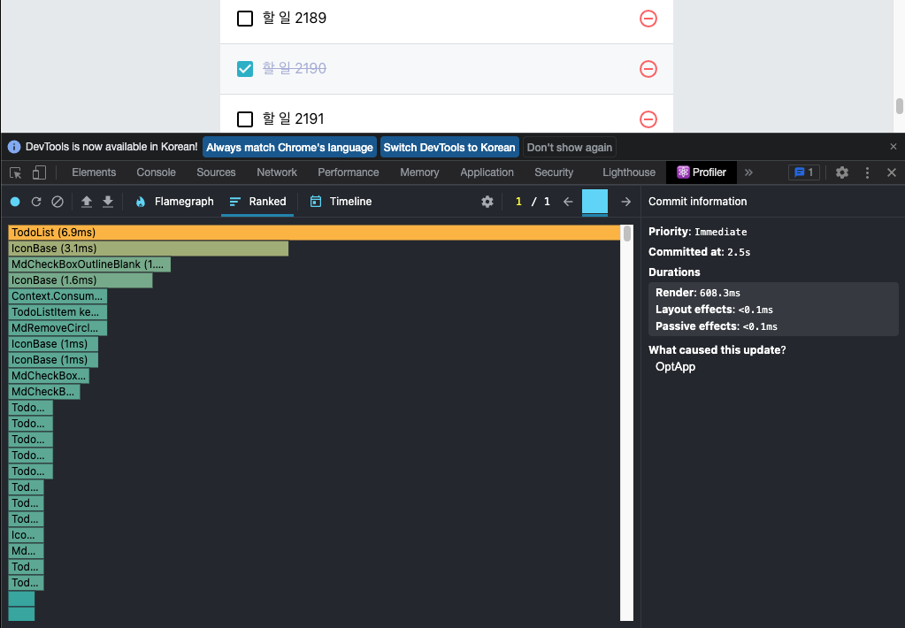
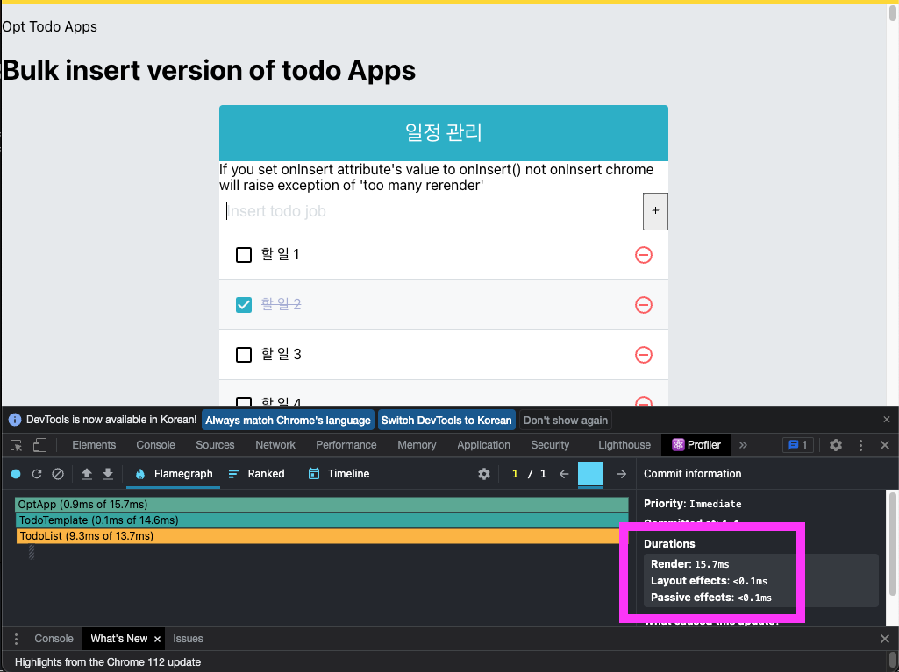
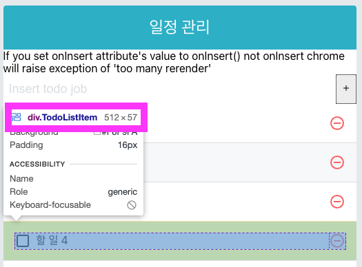

>💡 info
>component optimization is important when add massive data insert

> OptApp.jsx
```jsx
import { useState, useRef, useCallback } from 'react';
import TodoTemplate from './TodoTemplate';
import TodoInsert from './TodoInsert';
import TodoList from './TodoList';

import React from 'react';

function createBulkTodos() {
  const array = [];
  for (let i = 1; i <= 2500; i++) {
    array.push({
      id: i,
      text: `할 일 ${i}`,
      checked: false,
    })
  }
  return array;
}

const OptApp = () => {
  const [todos, setTodos] = useState(createBulkTodos);

  // unique id
  const nextId = useRef(2501);


  const onInsert = useCallback(
      (text) => {
        const todo = {
          id: nextId.current,
          text,
          checked: false,
        };
        setTodos(todos.concat(todo));
        nextId.current += 1; // add one to nextId
      },
      [todos],
  );

  const onRemove = useCallback(
      (id) => {
        setTodos(todos.filter(todo => todo.id !== id));
      },
      [todos],
  );

  const onToggle = useCallback(
      id => {
        setTodos(
            todos.map(todo =>
                todo.id === id ? { ...todo, checked: !todo.checked } : todo,
            ),
        );
      },
      [todos],
  )

  return (
      <>
        <h1> Bulk insert version of todo Apps</h1>
        <TodoTemplate>
          If you set onInsert attribute's value to onInsert() not onInsert
          chrome will raise exception of 'too many rerender'
          <TodoInsert onInsert={onInsert}/>
          <TodoList todos={todos} onRemove={onRemove} onToggle={onToggle}/>
        </TodoTemplate>
      </>
  );
};

export default OptApp;

```

but my macbook pro m1 max has monster performance to rendering.


680ms is not good performance just one item modify...

<br />

### 11.3 find the reason why performance degradation
---
> 💡 Rerendering 
> 1. props change
> 2. state change
> 3. parent component rendering
> 4. forceUpdate function call
> Let's dgging out the reason...
> 
> Check just one item that make `OptApp` state change.
> `OptApp` component will rerendering -> `TodoList` component rerendering -> `TodoListItem` component rerendering...
> Let's check it out prevent unnessasary rerendering.

<br />

## 11.4 use `React.memo` to component performance optimization
---
> **💡 info**
> If you want prevent rerendering in chater 7 introduce `shoudComponentUpdate` lifecycle mehtod. In functional component, you can't use lifecycle mehtod.
> In functional component you can use `React.memo` function.
> Using `React.memo` is very easy.
> Make component and just wrapping.
> Let's check it out.

> TodoListItem.jsx
```jsx
import React from 'react';
import {
  MdCheckBox,
  MdCheckBoxOutlineBlank,
  MdRemoveCircleOutline,
} from 'react-icons/md';
import cn from 'classnames';
import './TodoListItem.scss';

const TodoListItem = ({todo: {id, text, checked}, onRemove, onToggle}) => {
  // const {id, text, checked} = todo;
  // console.log(`😎😎😎todo: ${JSON.stringify(todo)}`);
  console.log(`😎😎😎text: ${JSON.stringify(text)}`);
  console.log(`😎😎😎checked: ${JSON.stringify(text)}`);

  return (
      <div className={"TodoListItem"}>
        <div className={cn("checkbox", {checked})} onClick={() => onToggle(id)}>
          {checked ? <MdCheckBox />: <MdCheckBoxOutlineBlank />}
          <div className="text">{text}</div>
        </div>
        <div className="remove" onClick={() => onRemove(id)}>
          <MdRemoveCircleOutline />
        </div>
        
      </div>
  );
};

export default React.memo(TodoListItem);

```
just.. last line you can see export with `React.memo`
`TodoListItem` component will not rerendering except `todo, onRemove, onToggle` change.

<br />

## 11.5 prevent reloading `onToggle`, `onRemove` function 
---
> **💡 info**
> Using `React.memo` is can't complete component optimization.
> when `totos` array change. `onRemove`, `onToggle` function will reloading.
> 1. `useState` functional update 
> 2. useReducer

<br />

### 11.5.1 `useState` functional update
---
>**💡 info**
> When `setTodos` function called, some value is passed as parameter.
> Pass `updater function` as a setState function parameter.

`updater function` can take `pending state` that has a updated value before rerendering.

let's modify `OptApp` to use functional update,in `onRemove, onToggle, onInsert`.

> TodoApp.jsx
```jsx
import React, {useCallback, useRef, useState} from 'react';
import TodoTemplate from './TodoTemplate';
import TodoInsert from './TodoInsert';
import TodoList from './TodoList';

const TodoApp = () => {
  const [todos, setTodos] = useState([
    {
      id: 1,
      text: "Let's check it out react basic",
      checked: true,
    },
    {
      id: 2,
      text: "Let's styling component",
      checked: true,
    },
    {
      id: 3,
      text: "create todo app",
      checked: false,
    }
  ]);

  const nextId = useRef(4);

  const onInsert = useCallback(
      (text) => {
        const todo = {
          id: nextId.current,
          text,
          checked: false,
        };
        setTodos(todos => todos.concat(todo));
        nextId.current += 1; // add one to nextId
      },
      [],
  );

  const onRemove = useCallback(
      (id) => {
        setTodos(todos => todos.filter(todo => todo.id !== id));
      },
      [],
  );

  const onToggle = useCallback(
      id => {
        setTodos( todos =>
            todos.map(todo =>
              todo.id === id ? { ...todo, checked: !todo.checked } : todo,
            ),
        );
      },
      [],
  )

  return (
      <TodoTemplate>
        If you set onInsert attribute's value to onInsert() not onInsert
        chrome will raise exception of 'too many rerender'
        <TodoInsert onInsert={onInsert}/>
        <TodoList todos={todos} onRemove={onRemove} onToggle={onToggle}/>
      </TodoTemplate>
  );
};

export default TodoApp;

```

change `deps` to empty array in `useCallback` second parameter.


600ms -> 18ms wow

<br />

### 11.5.2 use `useReducer`
---
> **💡 info**
> If you use `useReducer`, you can resolve `onToggle`, `onRemove` rerendering problem.

>UseReducerApp.jsx
```jsx
import {useState, useRef, useCallback, useReducer} from 'react';
import TodoTemplate from './TodoTemplate';
import TodoInsert from './TodoInsert';
import TodoList from './TodoList';

import React from 'react';

function createBulkTodos() {
  const array = [];
  for (let i = 1; i <= 2500; i++) {
    array.push({
      id: i,
      text: `할 일 ${i}`,
      checked: false,
    })
  }
  return array;
}

function todoReducer(todos, action) {
  switch (action.type) {
    case 'INSERT': // new item add
      // {type: 'INSERT', todo: { id: 1, text: 'todo', checked: false}}
      return todos.concat(action.todo);
    case 'REMOVE': //delete
      // {type: 'REMOVE', id: 1}
      return todos.filter(todo => todo.id !== action.id);
    case 'TOGGLE':
      // {type: 'TOGGLE', id: 1}
      return todos.map(todo =>
          todo.id === action.id ? { ...todo, checked: !todo.checked } : todo,
      );
    default:
      return todos;
  }
}

const UseReducerApp = () => {
  // const [todos, setTodos] = useState(createBulkTodos);
  const [todos, dispatch] = useReducer(todoReducer, undefined, createBulkTodos)
  // unique id
  const nextId = useRef(2501);


  const onInsert = useCallback(
      (text) => {
        const todo = {
          id: nextId.current,
          text,
          checked: false,
        };
        // setTodos(todos => todos.concat(todo));
        dispatch({ type: 'INSERT', todo })
        nextId.current += 1; // add one to nextId
      },
      [],
  );

  const onRemove = useCallback(
      (id) => {
        // setTodos(todos => todos.filter(todo => todo.id !== id));
        dispatch({type: 'REMOVE', id})
      },
      [],
  );

  const onToggle = useCallback(
      id => {
        // setTodos(todos =>
        //     todos.map(todo =>
        //         todo.id === id ? { ...todo, checked: !todo.checked } : todo,
        //     ),
        // );
        dispatch({type: 'TOGGLE', id})
      },
      [],
  )

  return (
      <>
        <h1> Bulk insert version of todo Apps</h1>
        <TodoTemplate>
          If you set onInsert attribute's value to onInsert() not onInsert
          chrome will raise exception of 'too many rerender'
          <TodoInsert onInsert={onInsert}/>
          <TodoList todos={todos} onRemove={onRemove} onToggle={onToggle}/>
        </TodoTemplate>
      </>
  );
};

export default UseReducerApp;

```
when use `useReducer`, initial value to second parameter and function that make initail value to third parameter.
Pros is outside of component.

<br />

## 11.6 the importance of imvariant
---
> Example. shallow copy
```jsx
const array = [1,2,3,4,5];

const nextArrayBad = array;
nextArrayBad[0] = 100;
console.log(array === nextArrayBad); // true

const nextArrayGood = [...array];
nextArrayGood[0] = 100;
console.log(array === nextArrayGood); //false 

const object = {
  foo: 'bar',
  value: 1
};

const nextObjectBad = object;
nextObjectBad.value = nextObjectBad.value + 1;
console.log(object === nextObjectBad); // true

const nextObjectGood = {
  ...object,
  value: object.value + 1 // overwrite new value
};
console.log(object === nextObjectGood); // false
```

If imvariant not maintained inner value of array or object can't find.
Additionally destructuring operator is shallow copy

> Example. shallow copy 2
```jsx
const todos = [{ id: 1, checked: true }, { id: 2, checked: true }];
const nextTodos = [...todos];

nextTodos[0].checked = false;
console.log(todos[0] === nextTodos[0]); // true

nextTodos[0] = {
  ...nextTodos[0],
  checked: false
};
console.log(todos[0] === nextTodos[0]); // false
```

```jsx
const nextComplexObject = {
  ...complexObject,
  objectInside: {
    ...complexObject.objectInside,
    enabled: false
  }
};

console.log(complexObject === nextComplexObject); //false
console.log(complexObject.objectInside === nextComplexObject.objectInside); //false
```
If you want to maintain imvariant complex object, use `immer` library to the next chapter.

<br />

## 11.7
---
>TodoList.jsx
```jsx
import React from 'react';  
import TodoListItem from './TodoListItem';  
  
const TodoList = ({todos, onRemove, onToggle}) => {  
  return (  
      <div className='TodoList'>  
        {todos.map(todo => (  
            <TodoListItem  
                todo={todo}  
                key={todo.id}  
                onRemove={onRemove}  
                onToggle={onToggle}  
            />        ))}  
      </div>);  
};  
  
export default React.memo(TodoList);
```

It's not better performance because `TodoList` only rerendering when `todos` array are changed.
If `OptApp` has other state, and `TodoList` will re-rendering unnecessarily.

<br />

## 11.8 rendering optimization use `react-virtualized`
---
> **💡 info**
> We see re-rendering performance optimization.
> We can see not all 2500 items of list. 
> Use `react-virtualized` we can prevent waste of resource.

<br />

### 11.8.1 prerequisite
---
```bash
yarn add react-virtualized
```

Use List component of `react-virtualized`
first we must know item's pixel size.

We can find the size some `div` using chrome developer tool.
that size is 57 pixel

<br />

### 11.8.2 Modify TodoList 
---
> TodoList
```jsx
import React, {useCallback} from 'react';
import {List} from 'react-virtualized';
import TodoListItem from './TodoListItem';
import './TodoList.scss'

const TodoList = ({todos, onRemove, onToggle}) => {
  const rowRenderer = useCallback(
    ({index, key, style}) => {
      const todo = todos[index];
      return (
        <TodoListItem
          todo={todo}
          key={key}
          onRemove={onRemove}
          onToggle={onToggle}
          style={style}
        />
      );
    },
    [onRemove, onToggle, todos],
  );

  return (
    <List
      className='TodoList'
      width={512} // total width
      height={513} // total height
      rowCount={todos.length}
      rowHeight={57} // item height
      rowRenderer={rowRenderer} //rendering function
      list={todos}
      style={{outline: 'none'}}
    />
  );
};

export default React.memo(TodoList);


```

For `List` component, we newly write `rowRenderer` function. This function use when rendering each `TodoListItem` rendering.
we pass some props (function, array, total height, width, and so on) to `List` and that library perform optimization automatically.

<br />

### 11.8.3 modify 'TodoListItem'
---
> TodoListItem.jsx
```jsx
import React from 'react';
import {
  MdCheckBox,
  MdCheckBoxOutlineBlank,
  MdRemoveCircleOutline,
} from 'react-icons/md';
import cn from 'classnames';
import './TodoListItem.scss';

const TodoListItem = ({todo: {id, text, checked}, onRemove, onToggle, style}) => {
  // const {id, text, checked} = todo;
  // console.log(`😎😎😎todo: ${JSON.stringify(todo)}`);
  console.log(`😎😎😎text: ${JSON.stringify(text)}`);
  console.log(`😎😎😎checked: ${JSON.stringify(text)}`);

  return (
    <div className='TodoListItem-virtualized' style={style}>
      <div className={"TodoListItem"}>
        <div className={cn("checkbox", {checked})} onClick={() => onToggle(id)}>
          {checked ? <MdCheckBox />: <MdCheckBoxOutlineBlank />}
          <div className="text">{text}</div>
        </div>
        <div className="remove" onClick={() => onRemove(id)}>
          <MdRemoveCircleOutline />
        </div>

      </div>
    </div>
  );
};

export default React.memo(TodoListItem);

```

we wrap `div` old jsx return value, asign className `TodoListItem-virtualized` className set `style` from props.


> TodoListItem.scss
```css
.TodoListItem-virtualized {  
  & + & {  
    border-top: 1px solid #dee2e6;  
  }  &:nth-child(even) {  
    background: #f8f9fa;  
  }}
```

for odd, even row style differnent


we optimized render time 15ms -> 7.5ms ‼️

<br />

## 11.9 Summary
---
We see this chapter many list item cause lack of loading, and resolve using rendering optimization.
React basically fast, so every page need optimization, but if you make list over 100 items and update frequently, using this optimization.