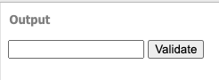

> #### 💡Info
> 일반 HTML에서 DOM 요소에 이름을 달 때는 id 속성 값을 사용합니다.
> 아래 코드와 같이 react의 index.js에서도 root라는 이름을 가진 요소에 리엑트 컴포넌트를 렌더링하라는 코드가 있습니다.
```javascript
const root = ReactDOM.createRoot(document.getElementById('root'));
```
> 리엑트 프로젝트 내부에서 DOM에 이름을 다는 방법이 있는데 이것이 ref 입니다.

<br />

> #### 📙Note
> React component에 id를 사용하면 안되나요❓
> id를 사용해도 됩니다. 하지만 아래와 같은 주의사항이 따릅니다. 그래서 특수한 경우가 아니라면 사용을 권장하지 않습니다.
> - 컴포넌트를 반복적으로 사용한다고 가정한다면, 동일한 id를 가진 DOM들이 생겨날 수 있습니다.
> 	- ref는 전역적으로 사용되기 때문에 이런 문제가 생기지 않습니다. 
> - 이를 해결하기 위해서는 id 뒷 부분에 추가적인 텍스트를 붙여서 중복 id가 생성되는 것을 방지해야 합니다.

<br />

### 5.1 ref는 어떤 상황에서 사용해야 할까?
---
>#### 💡Info
>먼저 ref는 '어떤' 작업을 해야할 때 사용되야 할까요❓
> DOM을 직접 접근해야 하는 경우에 사용 됩니다.

```javascript
<!DOCTYPE html>
<html>
<head>
  <meta charset="utf-8">
  <meta name="viewport" content="width=device-width">
  <title>Example</title>
  <style>
    .success {
      background-color: lightgreen;
    }

    .failure {
      background-color: lightcoral;
    }
  </style>
  <script>
    function validate() {
      var input = document.getElementById('password');
      input.className='';
      if(input.value==='0000') {
        input.className='success';
      } else {
        input.className='failure';
      }
    }
  </script>
</head>
<body>
  <input type="password" id="password"></input>
  <button onclick="validate()">Validate</button>
</body>
</html>
```

위 코드를 보면 `password`라는 id를 가진 DOM 요소에 값을 가져와서 비교 후 className을 바꿀 수 있습니다.



<p align="center" width="100%">
     
</p>

하지만 react에서는 state를 사용해서 위 작업을 수행할 수 있습니다. 

이 장에서는 클래스형 컴포넌트의 경우만 살펴보겠습니다. 
함수형 컴포넌트의 경우 Hooks와 같이 사용해야 하기 때문에 8장에서 Hooks를 배우면서 살펴볼 예정입니다.

> #### 💡Info
> 컴포넌트 만들기 -> input에 ref달기 -> 버튼 클릭 이벤트 발생 시마다 포커스 추가

<br />

#### 5.1.1 예제 컴포넌트 생성
---
```css
.success {
    background-color: lightgreen;
}

.failure {
    background-color: lightcoral;
}
```

<br />

#### 5.1.3 situation that must Use DOM (Can't use state only)
---
- focus on specific input 
- control scrol box 
- draw canvas element

<br />

### 5.2 use ref
---

<br />

#### 5.2.1 use callback function to use ref
---
use callback function to make ref is basic way in react. Send that information using ref to element set 'ref' via props that callback function get 'ref' as a parameter.
You can change `this.input` to `this.superman` (input or superman is user-defined name of ref)
```javascript
<input ref={(ref) => {this.input=ref}} />
```


<br />

#### 5.2.3 createRef 
---
react version 16.3 support this feature
look at the example, using `React.creawteRef()` function to assign variable name `input`
and  when you use this `ref` add <mark> `current` </mark> attribute (this is constraint of using createRef() function)

> 💡 Warnning
>  add current attribute of user-defined ref name
>  this.<mark>(user-defined name)</mark>.current

<br />

```javascript
import React, {Component} from 'react';

class RefUsingCreateRef extends Component {
  input =  React.createRef();

  handleFocus = () => {
    this.input.current.focus();
  }

  render() {
    return (
        <div>
          <p>RefUsingCreateRef</p>
          <input ref={this.input} />
        </div>
    )
  }
}

export default RefUsingCreateRef;
```

<br />

#### 5.2.3 Apply
---

##### 5.2.3.1 add ref on input tag
---
assign ref on input tag(functional component)

<br />

##### 5.2.3.2 modify button onClick event code base
---
Modify code base to focus on input tag,  when onClick event occur in button.

<br />

```javascript
import React, {Component} from 'react';  
import './ValidationSample.css';  
  
class ValidationSampleWithRefFocus extends Component {  
  state = {  
    password: '',  
    clicked: false,  
    validated: false,  
  };  
  
  handleChange = (e) => {  
    this.setState({  
      password: e.target.value  
    });  
  };  
  
  handleButtonClick = () => {  
    this.setState({  
      clicked: true,  
      validated: this.state.password == '0000'  
    })  
    this.input.focus();  
  }  
  
  render() {  
    return (  
        <div>  
          <p>Ref with focus</p>  
          <input  
              type={'password'}  
              value={this.state.password}  
              onChange={this.handleChange}  
              ref={(ref) => this.input = ref}  
              className={this.state.clicked ?  
                  (this.state.validated ? 'success' : 'failure') :  
                  ''}  
          />  
          <button onClick={this.handleButtonClick}  
          > Validated  
          </button>  
        </div>  
    );  
  }  
}  
  
export default ValidationSampleWithRefFocus;
```

<br />

You can confirm focus of cursor at input box.

<br />

### 5.3 Ref on component
---
> #### 💡Info
> In react you can assign ref on component. This usually use external component access DOM of internal component. it's assigning use case is same as  DOM.

<br />

#### 5.3.1 Use case
---

```javascript
<MyComponent
    ref={(ref) => {
      this.userDefinedName = ref;
    }}
/>
```

you can access method or member of userDefinedName component. (ex: userDefinedName.handleClick, userDefinedName.input etc)
Let's make component that has scroll box and delegate the action that pull down scroll-bar  to parent component.

> #### 💡Info
> - create Sendbox component.
> - assign ref to component
> - call function in compnent using ref

<br />

#### 5.3.2 Initial setting of component
---
Let's create ScrollBox component file.

##### 5.3.2.1 Create component file
---

```javascript
import React, {Component} from 'react';

class ScrollBox extends Component {
  render() {
    const style = {
      border: '1px solid black',
      height: '300px',
      width: '300px',
      overflow: 'auto',
      position: 'relative',
    };

    const innerStyle = {
      width: '100%',
      height: '650px',
      background: 'linear-gradient(white, black)',
    };
    return (
        <div
            style={style}
            ref={(ref) => {
              this.box = ref;
            }}
        >
          <div style={innerStyle}/>
        </div>
    );
  }
}

export default ScrollBox;
```


<br />

##### 5.3.2.2 Rendering ScrollBox component in App component
---

<br />

#### 5.3.3 Create mehod in component
---
Create method that pull down scroll. 
> #### 💡Info
> - scrollTop: vertical scroll-bar position(0~350)
> - scrollHeight: Div height in scroll box()
> - clientheight: Height of Box that have scroll(300)

<br />

#### 5.3.4 assign ref on component and use internal method
---

```javascript
import React, {Component} from 'react';
import ScrollBoxWithPullDownMethod from './ScrollBoxWithPullDownMethod';

class ParentScrollBox extends Component {
  render() {
    return (
        <div>
          <ScrollBoxWithPullDownMethod ref={(ref) => this.scrollBox = ref} />
          <button onClick={() => {this.scrollBox.scrollToBottom()}}>
            Go to bottom
          </button>
        </div>
    );
  }
}

export default ParentScrollBox;
```

`onClick = {this.scrollBox.scrollToBottom}` is correct syntax but, `this.scrolBox` is undefined so it occur exception. If you make new function in onClick attribute, this.scrollBox 
variable is defined before click button element.

<br />

### 5.4 Summary
---
> use ref between components is not fit react objective.
> Only use refs between components that relationship is parent and child.